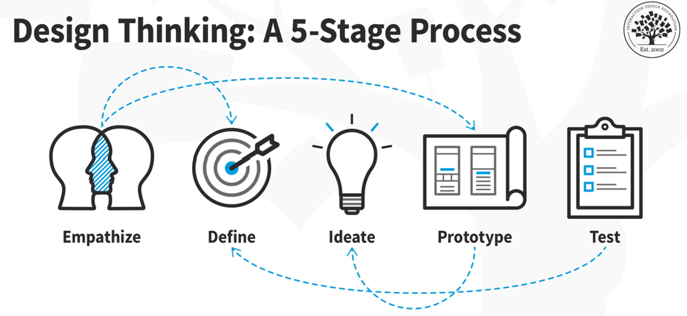
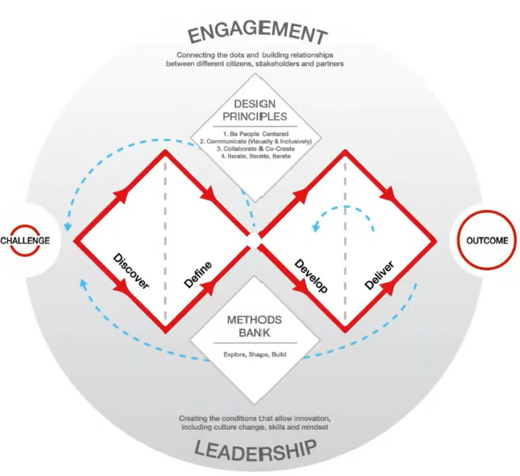
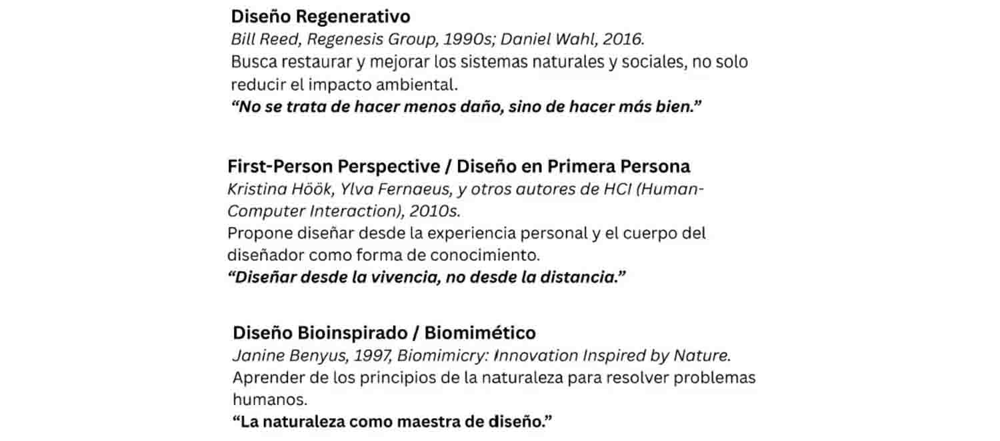
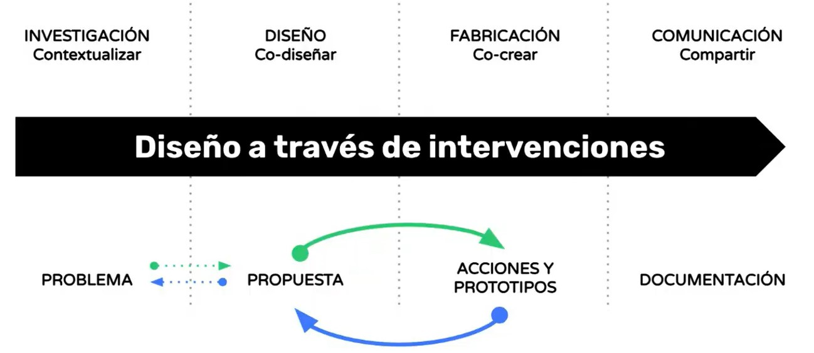
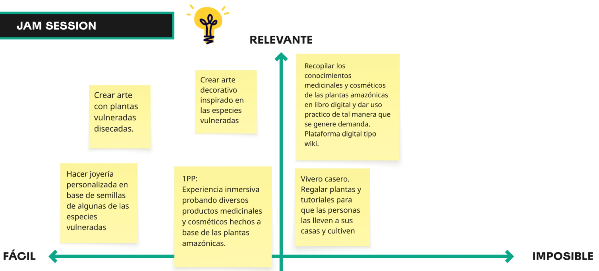
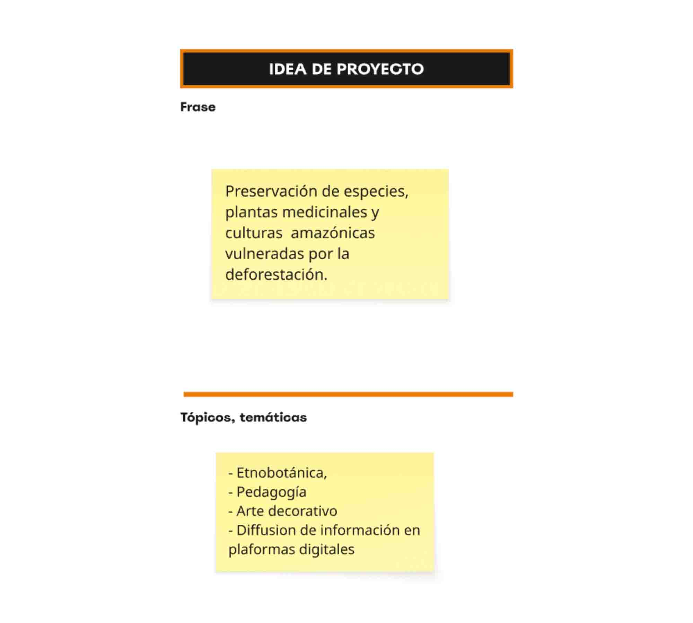

# MD02

Iniciamos las charlas del MD02 con “The Squiggle” (el grabato) de Damien Newman

Es un garabato lineal que empieza con un trazo enredado, y poco a poco se va ordenando hasta convertirse en una línea recta.
Simboliza cómo los proyectos de diseño, comienzan desordenados, llenos de incertidumbre y exploración, y luego se van clarificando hasta llegar a una solución concreta.
Se usa mucho en Design Thinking, para explicar que la confusión inicial es parte natural del camino hacia la claridad.
Design Thinking:
‘El pensamiento de diseño es un enfoque centrado en las personas para la innovación, que combina las necesidades humanas, las posibilidades tecnológicas y los requisitos para el éxito’.
Tim Brown (IDEO, 2008) Harvard Business Review, “Design Thinking”

 Aprendimos el modelo del Doble Diamante del British Council que es un proceso de diseño que se basa en dos fases de pensamiento divergente y convergente que estructuran el camino desde la comprensión del problema hasta la entrega de soluciones. 
 Además, dentro del marco de innovación, cuando se va en favor de generar innovación social, esto implica otros factores como el compromiso de las comunidades, y que sea sostenible en el tiempo.

También, revisamos otras tendencias de diseño de las cuales rescato para mi proyecto las siguientes:

Luego pasamos a definir las intervenciones que podemos implementar para definir nuestro proyecto. Estas son acciones de diseño situadas en un contexto real que involucra a la comunidad objeto de estudio. 

Finalmente pasamos a completar el siguiente MIRO board el cual nos permite estructurar nuestro proyecto.
 [link MIRO](https://miro.com/app/board/uXjVJ0RGljI=/)

 
 
 
 
 
 

Reflexión 

Este módulo me permitió aplicar diferentes herramientas de diseño para desarrollar mi proyecto. Con Design Thinking pude diseñar con la mirada centrada en las personas. El Doble Diamante me ayudó a estructurar el proceso en fases claras. Las Intervenciones garantizan que el diseño sea co-creado, contextual y transformador, no solo un producto externo.

