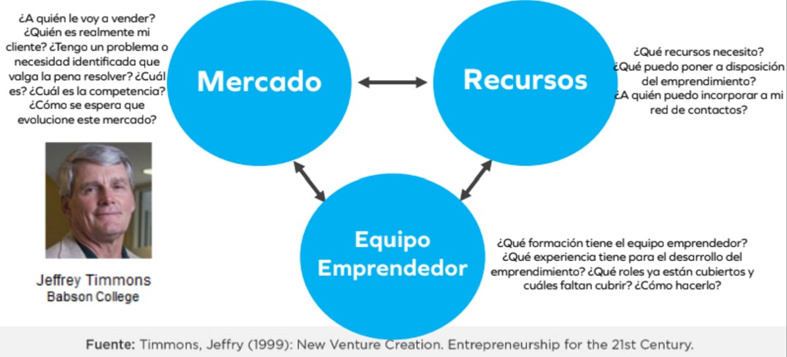
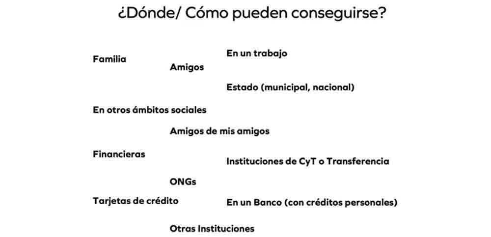

# MI03 MÓDULO DE EMPRENDIMIENTO

### PRIMERA ETAPA
Durante esta etapa virtual se nos presentaron los siguientes conceptos relacionados con la Actitud Emprendedora.

#### I.	Herramientas para el autoconocimiento

a.	Indicador Myer-Briggs Type (MBTI):  Este permite definir tu personalidad. Lo importante de definir la personalidad es que es más fácil encontrar perfiles complementarios para futuros negocios. 

b. Características de comportamiento de emprendedores de éxito por David McClelland:
•	Búsqueda de oportunidades e iniciativa
•	Correr riesgos calculados
•	Exigencia con la calidad y eficiencia
•	Persistencia
•	Comprometimiento
•	Búsqueda de informaciones
•	Establecimiento de metas
•	Planificación sistemática
•	Persuasión y red de contactos
•	Independencia autoconfianza

c.	El Test de inteligencias Múltiples de Howard Gardner 
Permite al individuo conocer sus habilidades cognitivas y a identificar aquellas áreas que necesitan más desarrollo. Además, esta información puede ser útil para elegir una carrera o profesión que se ajuste a las habilidades cognitivas de cada persona.

d.	Análisis FODA o SWOT en inglés. es una herramienta que ayuda a evaluar las Fortalezas, Oportunidades, Debilidades y Amenazas, tanto del equipo emprendedor como del negocio.

#### II.	Competencias del siglo XXI
La globalización y las tecnologías han transformado la comunicación, la producción de conocimiento y el mundo laboral, generando impactos locales y globales. Para desenvolverse en este nuevo contexto, los emprendedores necesitan habilidades analíticas, comunicativas, creatividad, iniciativa y capacidad de colaboración efectiva. Estas son las llamadas competencias del siglo XXI, que reúnen destrezas, conocimientos y actitudes esenciales para afrontar los retos actuales y replantear las metas de aprendizaje y acción en esta era.

#### III.	El Riesgo, El Éxito, el Fracaso, la Resiliencia y Aprender haciendo

El Riesgo es parte natural de la vida emprendedora y, aunque inevitable, constituye el motor del desafío de emprender. Reconocerlo permite anticiparse y diseñar estrategias para reducirlo o eliminarlo.
Asumir riesgos calculados significa:
•	Evaluar alternativas antes de decidir.
•	Minimizar errores.
•	Aceptar desafíos moderados con altas probabilidades de éxito.

Para lograrlo, el emprendedor debe:
•	Definir sus propios retos.
•	Organizar y procesar información.
•	Interpretar indicadores del entorno.
•	Tomar decisiones propias.
•	Planificar de manera sistemática

El Éxito en el emprendimiento no tiene una definición universal, pues es subjetivo y personal. Cada persona lo entiende de manera distinta, según sus sueños, pasiones y metas de vida.
Claves del éxito:
•	Es relativo: lo que para unos es triunfo, para otros puede ser apenas un consuelo.
•	Se asocia tanto a logros formales (graduarse, ascender, obtener buenas calificaciones) como a logros personales (crear una empresa, comprar una casa, formar una familia).
•	También puede encontrarse en pequeñas acciones cotidianas, como preparar una receta especial.
•	Su valor radica en la capacidad de superar adversidades, reconocer nuestras competencias y mantener el deseo de mejorar continuamente.

El miedo al éxito es una condición psicológica en la que las personas temen las consecuencias y responsabilidades que el éxito puede traer. Este temor puede ser consciente o inconsciente y suele estar ligado a:
•	La inseguridad sobre mantener el éxito y el miedo al fracaso.
•	La falta de confianza en sí mismos o la sensación de no merecerlo.
•	El temor al rechazo social.
Como resultado, quienes lo padecen tienden a sabotear sus propias oportunidades de alcanzar el éxito.
El Propósito empresarial, cuando está alineado con los valores de los consumidores, fortalece la conexión emocional y la resiliencia de la marca. En un mercado competitivo, la fidelidad surge cuando los clientes sienten que su inversión refleja sus propios valores y genera impacto positivo.

Claves del propósito en los negocios:
•	No importa tanto la cantidad de clientes, sino su lealtad e identificación con la marca.
•	Los millennials valoran más trabajar por un propósito que por un salario alto, y pronto serán la mayoría de la fuerza laboral.
•	Atraer talento que comparta los valores de la empresa genera pasión, compromiso y productividad.
•	Incluso con recursos limitados, muchas personas prefieren unirse a organizaciones que los motiven y les den orgullo, aunque el salario sea menor.

La tolerancia al fracaso consiste en transformar la frustración en aprendizaje y energía para mejorar, convirtiendo cada caída en una oportunidad de crecimiento.
La resiliencia es una habilidad que nos permite transformar las dificultades en crecimiento y fortaleza interior. 
Un emprendedor resiliente se caracteriza por:
1.	Autoconocimiento: reconoce sus fortalezas y límites, y aprende de ellos.
2.	Creatividad e innovación: busca constantemente nuevas alternativas en procesos y mercados.
3.	Confianza en sí mismo: fortalezas bien identificadas aumentan su seguridad.
4.	Aprendizaje de las dificultades: ve los problemas como oportunidades, no como victimización.
5.	Optimismo: mantiene una visión positiva hacia sus objetivos.
6.	Responsabilidad: asume compromisos y responde con iniciativa ante nuevas oportunidades.
7.	Espíritu de aprendiz: se abre a aprender incluso de fracasos, pérdidas o errores.
8.	Entorno positivo: se rodea de personas motivadas y con metas claras.
9.	Flexibilidad: se adapta a cambios y mejora continuamente.
10.	Tenacidad: mantiene firme su propósito y claridad en el “para qué”.
11.	Humor: afronta la adversidad con humor para liberar tensión y evitar la victimización.
12.	Humildad para pedir ayuda: sabe solicitar asistencia, consejo o apoyo cuando lo necesita.

Aprender Haciendo
El emprendimiento se aprende principalmente a través de la acción: arriesgar, prototipar, equivocarse y volver a intentar hasta encontrar soluciones innovadoras. El aprendizaje es más efectivo cuando se vive la experiencia directamente.

### SEGUNDA ETAPA
En la segunda etapa vimos las herramientas para la generación e identificación de ideas de negocio.

#### I.	¿Como desarrollar la habilidad creativa?

En primer lugar, definimos al EMPRENDEDOR quien no se caracteriza por lo que es, sino por lo que hace. Emprender es el proceso de identificar, evaluar y aprovechar oportunidades para el desarrollo del negocio. 

La generación y/o aprovechamiento de las Oportunidades depende de la capacidad de las personas de descubrir, a través de pensamientos creativos, soluciones que todavía no se han planteado.

La Creatividad e innovación: habilidad para romper limites, asumir riesgos. Las cosas creativas son nuevas diferentes y útiles. Esta se ejercita saliendo del pensamiento rutinario.

Barreras de la creatividad:

La Innovación es la introducción dentro de un contexto un producto (bien o servicio) nuevo o mejorado. Innovar no es necesariamente tener la idea que se distingue del resto. El que haya antecedentes sobre nuestra idea es un buen indicio para seguir explorando.

Hay muchas maneras de innovar, las primeras ideas no son las más originales o innovadoras. El forzarse a iterar múltiples veces permite pulir las ideas y llegar a un mejor resultado. No basta solo que las ideas sean creativas o atractivas, estas deben reunir también ciertos atributos.

#### II.	¿Como generar ideas de negocio?: Identificar oportunidades

1.	IDEAS A PARTIR DE NECESIDADES
Las condiciones para que haya una oportunidad de negocio son la creatividad e innovación y una necesidad o problema a resolver. La visión emprendedora es de detectar oportunidades/problemas/necesidades constantemente. Es de esta observación que surgen las ideas.
2.	IDEAS A PARTIR DE GUSTOS PERSONALES
El emprendedor distingue actividades que le gustan o que con cierta frecuencia realiza y disfruta. 
•	¿A cuántas personas le pueden inquietar lo mismo que a UD.?
•	¿Cómo puedo generar ingresos haciendo esa actividad? 
•	Analice si pueden ser ideas de un nuevo método, un nuevo producto (bien o servicio) o un nuevo concepto. 
•	¿Parece una idea de negocio?, o ¿Por los momentos no? 
•	¿Esta idea solo es aplicable a esta actividad o puede ser aprovechada por otra actividad similar?
3.	IDEAS A PARTIR DE EXPERIENCIA LABORAL

4.	IDEAS A PARTIR DE EXPERIENCIAS
•	Ferias
•	Viajes
•	Puplicaciones
•	Energías renovables

Herramientas para generar ideas:

#### III.	Validar si mi idea de negocio es buena

##### El Mercado 
Conjunto de todos los compradores reales y potenciales de un producto o servicio. Identificar un mercado suficientemente grande con clientes que necesiten mi producto y que paguen un precio en torno al cual pueda construir mi negocio.
Hay productos y servicios que llaman mucho la atención pero que no son fáciles de vender, muy atractivos, pero poco comercializables. Es importante conocer el mercado al que se va a dirigir el producto o servicio: identificarlo, cuantificarlo, conocerlo (saber sobre sus características, sus necesidades y hábitos de compra). 

La Segmentación dividir el mercado en grupos más pequeños con características y necesidades similares. Es imposible crear, diseñar y posicionar de manera eficaz un producto para todo el mundo.

##### Los Recursos 
¿Qué es más importante el dinero o los recursos? 
Es más fácil conseguir los recursos para el negocio que conseguir dinero. Estos los puedes conseguir de varias maneras.

##### El Equipo
El trabajo en equipo mejora el desempeño y la calidad, reduce cargas individuales, fomenta la inteligencia colectiva y el aprendizaje, convierte los conflictos en oportunidades, crea un buen ambiente laboral y otorga poder de decisión a quienes están más cerca de la acción. Roles clave en un equipo emprendedor 
•	Visionario/Estratega 
•	Defensor del cliente 
•	Técnico/Innovador/Diseñador 
•	Vigilante del dinero y recursos

Recomendaciones para formar un equipo emprendedor 
•	Buscar gente con talentos y ganas de trabajar. 
•	No rodearse de amigos, sino de profesionales. 
•	Motivar a los profesionales para que se unan al proyecto. 
•	No prometer imposibles 
•	Rodearse de personas con objetivos alineados. 
•	El equipo emprendedor debe ser heterogéneo. 
•	No querer ser el más listo. 
•	No permitir manzanas podridas en la organización.
¿Qué hacer para compensar deficiencias del equipo? 
•	Incorporar personas estratégicamente. 
•	Identificar y usar los puntos fuertes de cada uno. 
•	Debilitar el individualismo e incentivar la cooperación. 
•	Capacitarse continuamente 
•	Priorizar la comunicación eficaz y resolver los conflictos

#### REFLEXIÓN

La utilidad del curso radica en que prepara al estudiante para ser un emprendedor integral: alguien capaz de conocerse a sí mismo, generar ideas relevantes y convertirlas en proyectos concretos. Esta combinación fortalece la resiliencia frente al fracaso, fomenta la innovación y conecta la creatividad personal con las demandas reales del mercado. En otras palabras, el curso no solo enseña a pensar en negocios, sino a crear soluciones viables y sostenibles.
