# MT03

En este módulo técnico exploramos el corte laser y para el ejercicio final se creó un cofre de 16x8x4cm. El material utilizado MDF de 3mm de espesor. Programas utilizados para modelar Fusion, Autocad e Inkscape. A continuación, el proceso.

Pasos:

1. En Fusion crear parámetros. Se parametrizó ancho, alto y largo del cofre. Además de parametrizar las dimensiones del kerfing usado para la tapa.

2. Creacion de componentes. Primer componente creado es la base de la caja. 

3. Hacer un sketch y graficar un rectángulo usando x dimensiones los parámetros predeterminados. Graficar las muescas haciendo rectángulos y conectándolos con líneas, hacerlas de construcción y equidistantes.

Con dimensión aplicamos el parámetro PLY (ancho de MDF) 

Dar cota a una de las muescas. Usar número redondo.

Con espejo repetir lo mismo del otro lado. Usar el plano de origen como eje.

Repetir el proceso para hacer las muescas en el otro lado usando comando espejo.

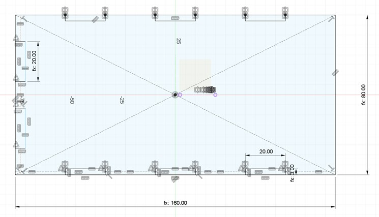

Extruir usando el parámetro PLY como altura y listo.

4.	Pasar a crear los otros dos Componentes de los lados chicos.  Usar offset plane en el borde chico para generar el plano donde poder graficar el sketch.

Terminado el sketch, extruir aplicando ancho parámetro PLY.

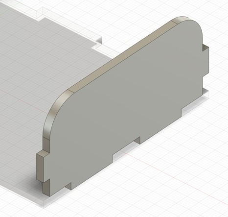

Usar mismo método para construir el Lado chico B.

5.	Construir la tapa que incluye las bisagras usando la herramienta Sheet Metal. Primero crear una regla para el MDF (PLY):

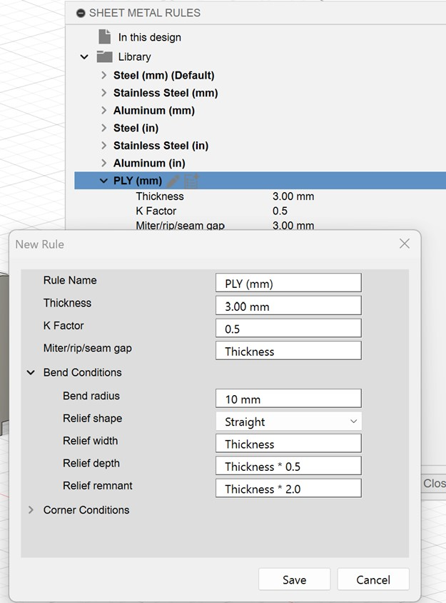

Crear nuevo componente para tapa escogiendo PLY:

En un plano de trabajo intermedio proyectar lado chico como guía para construir la tapa.

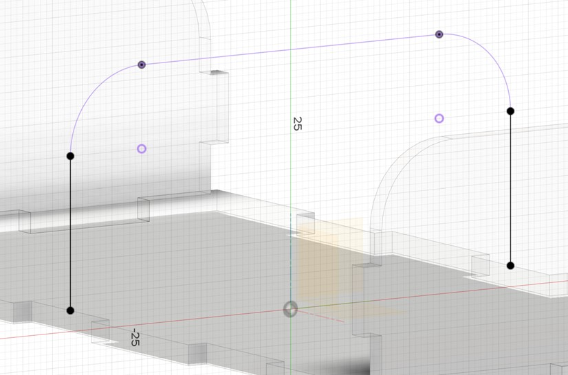

Usar comando Flange para construir la tapa.

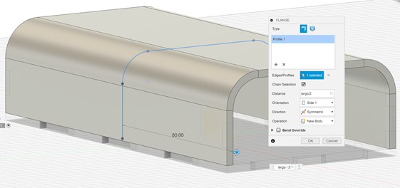

Para retirar las muescas en la tapa usar modify/combine/cut:

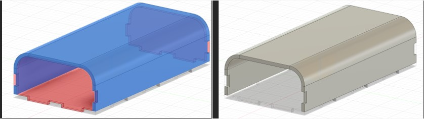

Estamos listos para desdoblar la tapa. Ir a Sheetmetal/modify/unfold:

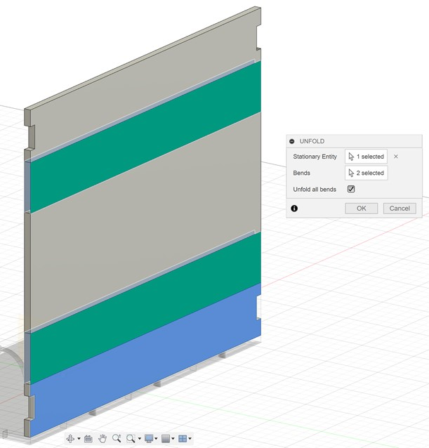

Crear un sketch y proyectar los puntos que limitan las bisagras: 

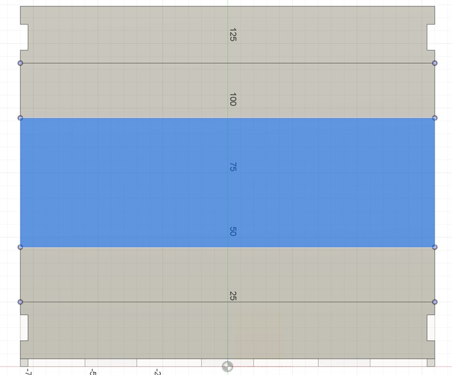

Empezamos a graficar las ranuras de las bisagras. 

Terminamos el sketch, se crea uno nuevo en el mismo plano, proyectamos las ranuras y creamos un patrón rectangular.

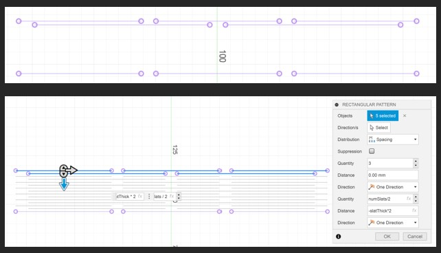

Apagamos ese sketch, creamos uno nuevo en el mismo plano. Y desdoblamos de vuelta a forma original el componente anteriorde la tapa.

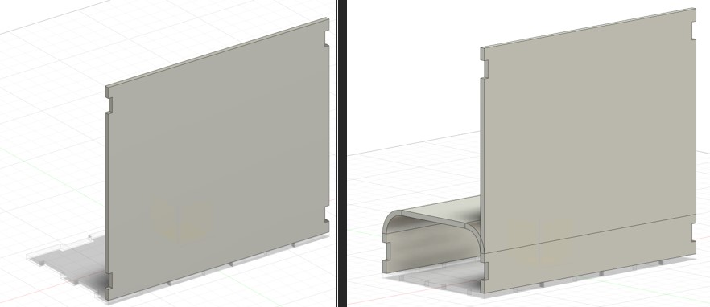

6.	Listos para pasar al espacio de Manofactura Y poder generar los planos de fabricación 2d para corte laser. 
Ir a Setup/manufacturing model/edit. Creamos sketch en el plano base y dibujamos un rectángulo de las dimensiones 600x450mm.
Para hacer el Nesting vamos a Modify/Arrange y seleccionamos todos los componentes que conforman las caras de la caja y como envelope al recuadro de 450x600m  y automáticamente crea el nesting

Creamos un Nuevo Setup en la pestaña de fabricación seleccionamos las piezas. Luego en Cutting/2d profile se generan los planos DXF que serán transmitidos a la cortadora laser para proceder con el corte.

En mi caso no pude terminar el proceso por que no tengo programada una cortadora laser y Fusion no me permite generar los planos 2d sin ese parámetro. Es un detalle que será resuelto en el transcurso de la semana cuando vayamos hacer los cortes en laboratorio.

Abajo imagen de cómo se ensamblan todos los componentes de la caja.

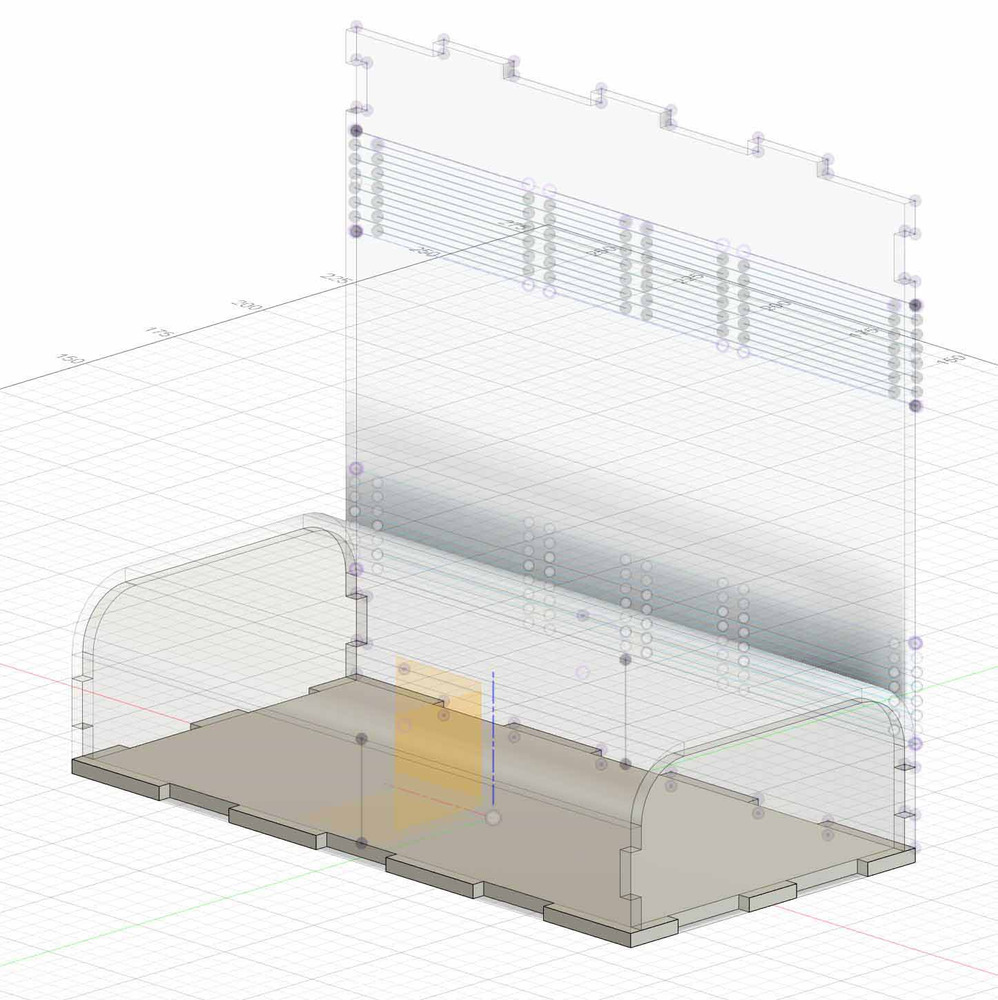

7. Una alternativa para cumplir la entrega fue exportar el archivo Fusion en DXF y trabajarlo en Autocad. El archivo contiene las dimensiones correctas y fue fácil editarlo. Se asignaron las capas para el corte laser correspondientes:

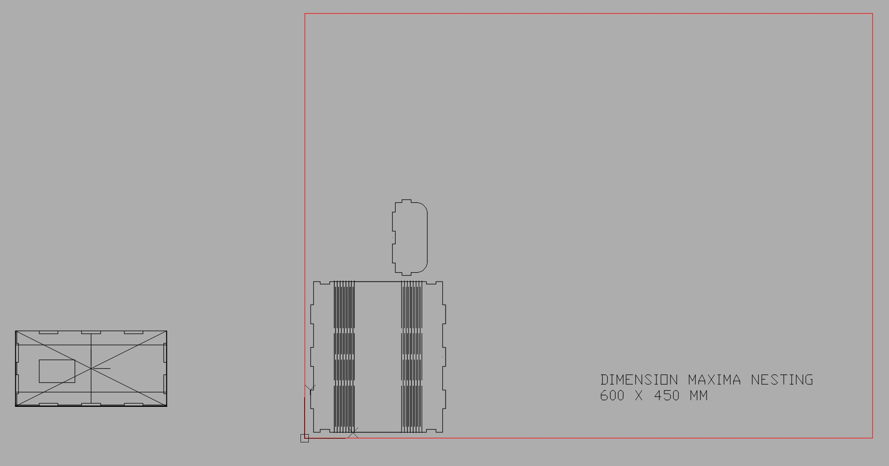
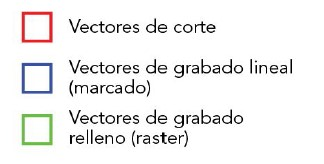

8. Finalmente se pasó el archivo a Ikscape para poder introducir el logo con texto vectorial.

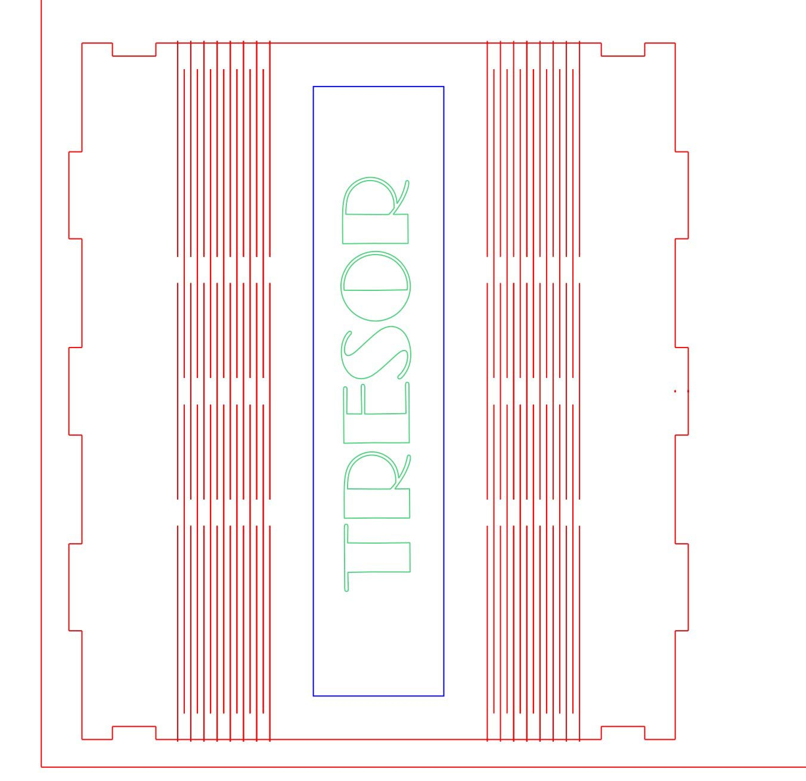

9. Para la entrega final se creó un archivo DXF con la dimensión del soporte MDF de 600x450mm y los componentes de la caja colocados en Nesting a fin de optimizar material.

10. En FAB LAB haciendo el corte laser del primer modelo:

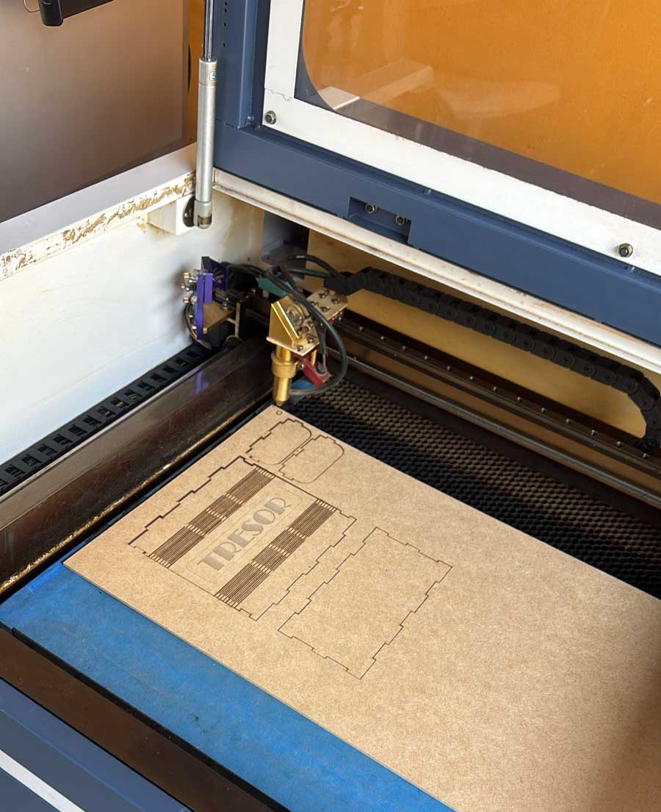

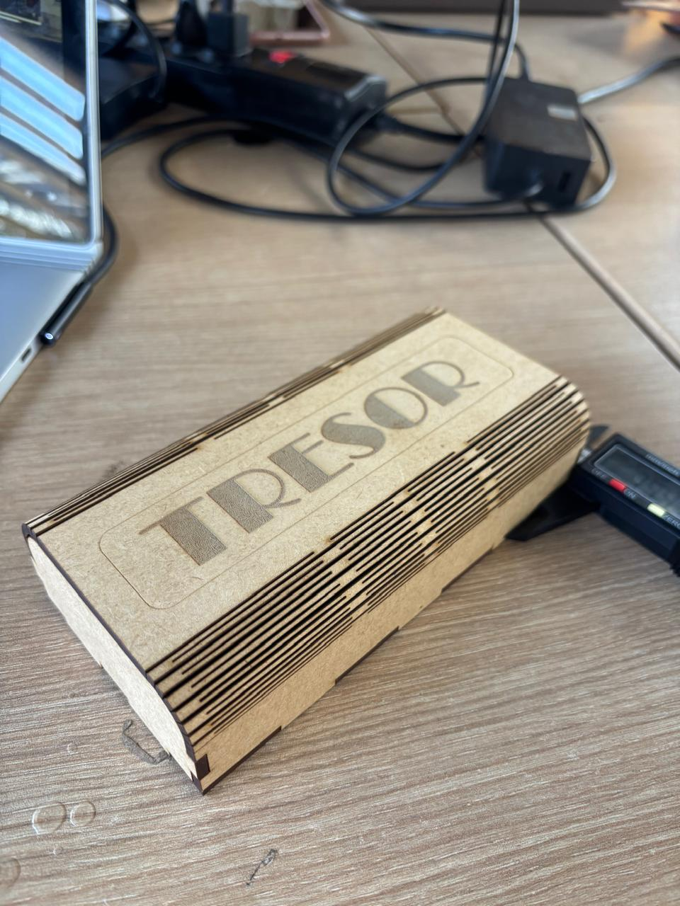

El diseño cumple con los requisitos de la asignatura además de incorporar kerfing, pero luego de fabricar el prototipo se percibe que los ensambles deben ser mejorados. Para este modelo se usaron ensambles ´finger joint´. 

11. En el segundo prototipo se usaron ensambles tipo Ranura y Lengüeta (Slot & Tab) que logran mayor estabilidad. 

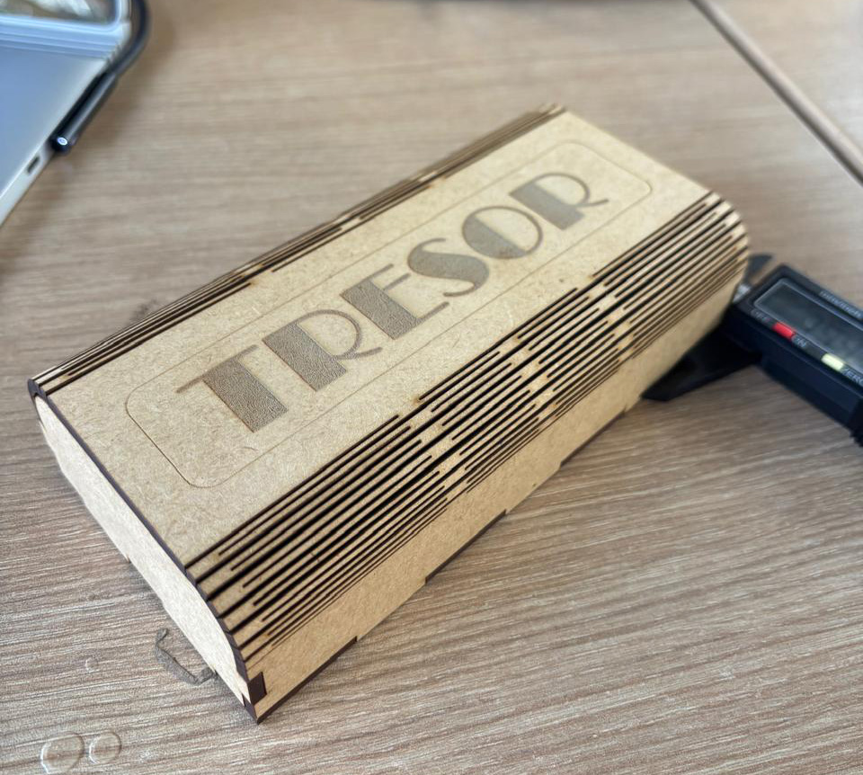

Este es el tutorial de youtube utilizado para construir la caja y el kerfing en Fusion:

[Watch the video](https://www.youtube.com/watch?v=HjXnGby1H_A)